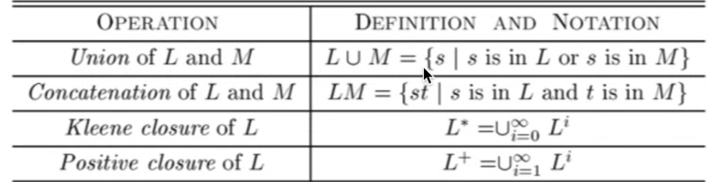

# Session 2

### Date: 29 Jan 2021

### Recall

**KEYWORD**

regular expressions

**RELEVANT QUESTION**

Why do we care about RE?

### Notes

- Specifications of tokens: some tokens are easy to specify and some are much harder to specify for example
    - identifiers: letters followed by letters and numbers
    - numbers ( 0 or digit from 1-9 followed by other digits)
- We need a powerful notation to specify these tokens
- From definition of **alphabet** and **string** we define language
- Operations on language:  (from the textbook)
    - Union
    - Concatenation: set of strings st where s is in language L and t is in language M
    - Kleene closure: (L star) → union of all the languages start with i=0 to infinite (L(i))
    - Positive closure

what's kleene closure really? What does mean L(star) for a language L? L = {A,B,C,D,....,a,b,c,d}

Its a set of all alphanumeric strings. Strings of 0 or more characters

### Regular Expressions

Regular expression r denotes a language L(r) (over an alphabet sigma) 

All regular expressions can be described with three operations:

- concatenation
- alteration
- kleene closure

(a | epsilon) is tedious so we use a? 

Algebraic laws also apply for regular expressions such as commutative and associative laws

**Why do we care about RE?**

We use RE for tokens

we use tools derived from automata theory to derive a DFA from the RE and then convert RE to code that implements a lexer 

RE-derived lexers are widely used 

Lecture now delves into finite automata and the algorithm behind it 

Difference between deterministic and non deterministic automata

deterministic:

- exactly one transition one input per state
- no epsilon

NFAs and DFAs recognize the same set of languages. DFAs are faster

Heart of scanner generator

- constuct finite automata
- DFA vs NFA
- We still need to know how to construct finite automata from RE to automatically generate lexer

Where are we moving?

From RE to DFA to table driven implementation of DFA

Why DFA? Because its faster 

Algorithm: NFA to DFA with subset construction 

- Derive the DFA start date from n0 of the NFA
- Add all reachable states from n0 (start state)
- for each state compute followepsiolon from there
- iterate until no more states are added

## Summary

**SUMMARY: Why do we care about Regular Expressions? For lexers, we**